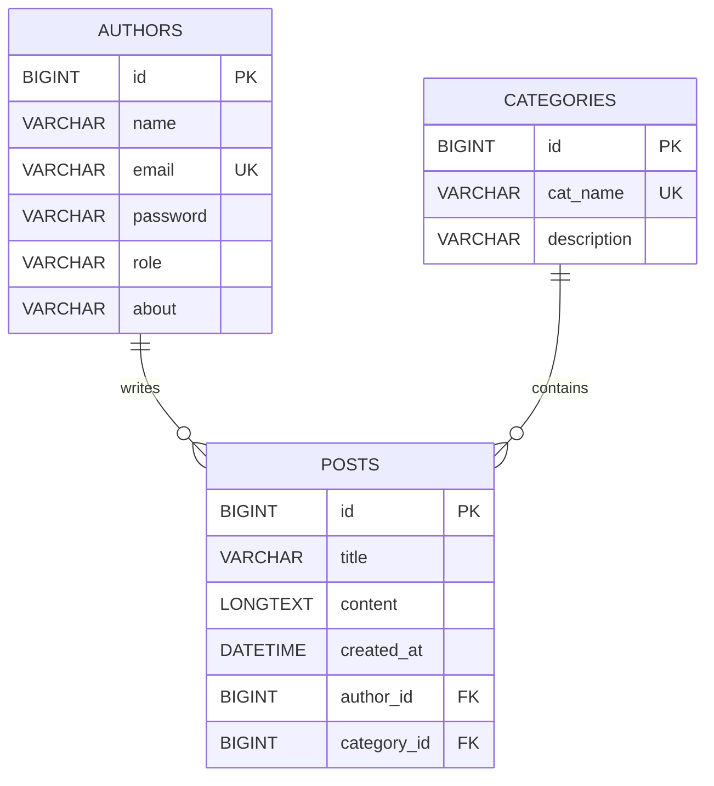
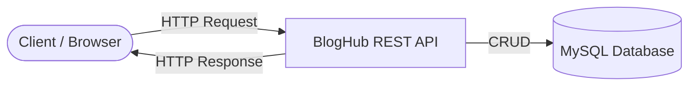
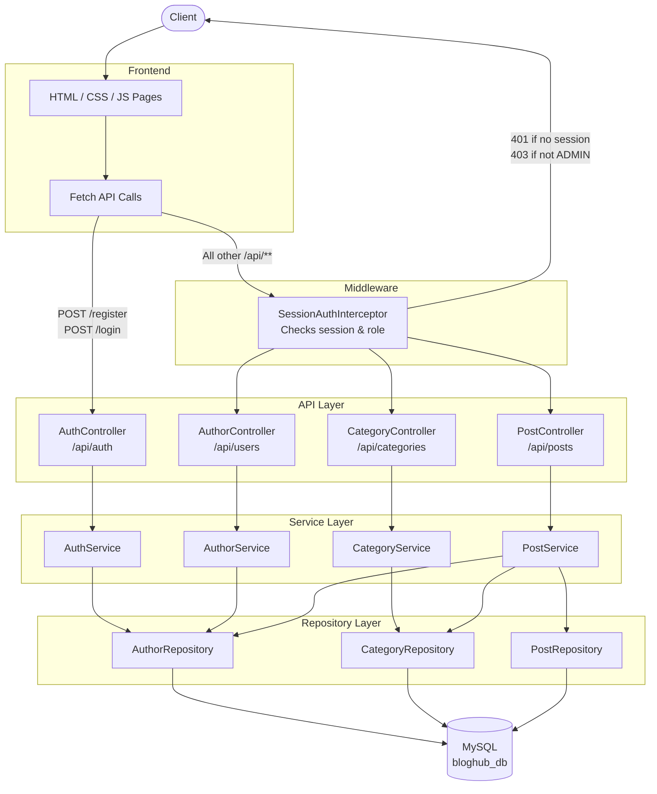
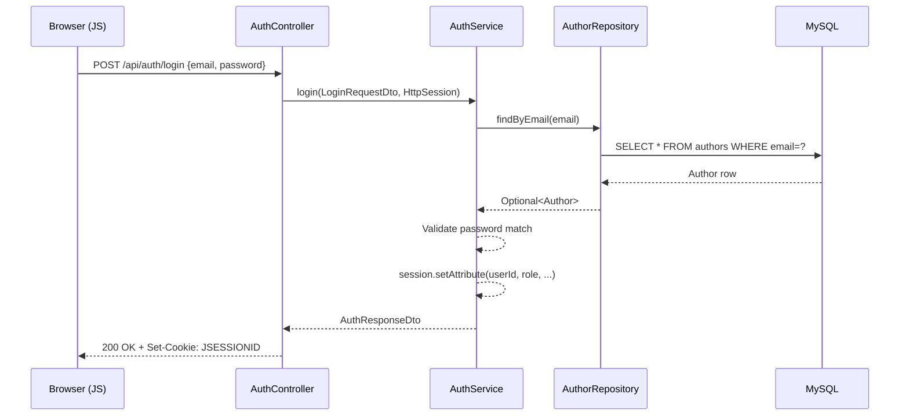

# 📝 BlogHub — Full-Stack Blogging Platform

A full-stack blogging platform with a **Vanilla JS + HTML/CSS frontend** and a **Spring Boot REST API** backend. Authors can register, write posts, manage categories (admin only), and search/browse content seamlessly.


---

## 📚 Table of Contents

- [Tech Stack](#-tech-stack)
- [Features](#-features)
- [Use Case Diagram](#-use-case-diagram)
- [ER Diagram](#-er-diagram)
- [Data Flow Diagram](#-data-flow-diagram)
- [Directory Structure](#-directory-structure)
- [API Reference](#-api-reference)
- [Getting Started](#-getting-started)
- [Session Management](#-session-management)
- [Roles & Permissions](#-roles--permissions)

---

## 🛠 Tech Stack

### Frontend

| Layer        | Technology                     |
|--------------|--------------------------------|
| Markup       | HTML5                          |
| Styling      | CSS3 (Custom Properties, Flexbox, Grid) |
| Scripting    | Vanilla JavaScript (ES6+)      |
| HTTP Client  | Fetch API                      |
| Routing      | Client-side (hash-based)       |
| State        | Session Cookie (`JSESSIONID`)  |

### Backend

| Layer        | Technology                      |
|--------------|---------------------------------|
| Framework    | Spring Boot 4.0.4               |
| Language     | Java 25                         |
| Database     | MySQL 8                         |
| ORM          | Spring Data JPA / Hibernate     |
| Auth         | Session-based (`HttpSession`)   |
| Validation   | Jakarta Bean Validation         |
| Build Tool   | Maven                           |

---

## ✨ Features

- 🔐 User registration & session-based login / logout
- 📝 Full CRUD for blog posts with pagination, sorting, and full-text search
- 🗂️ Category management — read for all users, write for **ADMIN only**
- 👤 Author profile management with role-based access control
- 🌐 Interactive frontend — no framework, pure HTML/CSS/JS
- ⚠️ Global exception handling with structured error responses

---

## 🧩 Use Case Diagram

```mermaid
graph TD
    Guest([Guest])
    User([Authenticated User])
    Admin([Admin])

    Guest --> UC1[Register]
    Guest --> UC2[Login]
    Guest --> UC3[Browse Posts]
    Guest --> UC4[Search Posts]
    Guest --> UC5[View Categories]

    User --> UC2
    User --> UC6[Logout]
    User --> UC7[View My Profile]
    User --> UC8[Update My Profile]
    User --> UC9[Create Post]
    User --> UC10[Update Own Post]
    User --> UC11[Delete Own Post]
    User --> UC12[View My Posts]
    User --> UC3
    User --> UC4
    User --> UC5

    Admin --> UC13[Create Category]
    Admin --> UC14[Update Category]
    Admin --> UC15[Delete Category]
    Admin --> UC16[Delete Any Post]
    Admin --> UC17[Delete Any User]
    Admin --> UC7
    Admin --> UC8
    Admin --> UC9
    Admin --> UC3
```



---

## 🗃️ ER Diagram



---

## 🔄 Data Flow Diagram

### Level 0 — Context Diagram



---

### Level 1 — Internal Data Flow



---

### Request-Response Flow (Login Example)



---

## 📁 Directory Structure

```
BlogHub/
├── pom.xml
├── .mvn/
│   └── wrapper/
│       └── maven-wrapper.properties
└── src/
    ├── main/
    │   ├── java/com/mardox/bloghub/
    │   │   ├── BlogHubApplication.java             # Entry point
    │   │   ├── config/
    │   │   │   └── WebConfig.java                  # Registers interceptor
    │   │   ├── controller/
    │   │   │   ├── AuthController.java              # /api/auth
    │   │   │   ├── AuthorController.java            # /api/users
    │   │   │   ├── CategoryController.java          # /api/categories
    │   │   │   └── PostController.java              # /api/posts
    │   │   ├── dto/
    │   │   │   ├── AuthResponseDto.java
    │   │   │   ├── AuthorResponseDto.java
    │   │   │   ├── AuthorUpdateDto.java
    │   │   │   ├── CategoryRequestDto.java
    │   │   │   ├── CategoryResponseDto.java
    │   │   │   ├── CategoryUpdateDto.java
    │   │   │   ├── LoginRequestDto.java
    │   │   │   ├── PostRequestDto.java
    │   │   │   ├── PostResponseDto.java
    │   │   │   ├── PostUpdateDto.java
    │   │   │   └── RegisterRequestDto.java
    │   │   ├── entity/
    │   │   │   ├── Author.java                     # authors table
    │   │   │   ├── Category.java                   # categories table
    │   │   │   └── Post.java                       # posts table
    │   │   ├── exception/
    │   │   │   ├── ErrorResponse.java
    │   │   │   ├── GlobalExceptionHandler.java
    │   │   │   ├── ResouceAlreadyExistsException.java
    │   │   │   └── ResourceNotFoundException.java
    │   │   ├── interceptor/
    │   │   │   └── SessionAuthInterceptor.java     # Auth guard
    │   │   ├── repository/
    │   │   │   ├── AuthorRepository.java
    │   │   │   ├── CategoryRepository.java
    │   │   │   └── PostRepository.java
    │   │   └── service/
    │   │       ├── AuthService.java
    │   │       ├── AuthorService.java
    │   │       ├── CategoryService.java
    │   │       └── PostService.java
    │   └── resources/
    │       ├── static/                             # Frontend (HTML/CSS/JS)
    │       │   ├── index.html
    │       │   ├── css/
    │       │   └── js/
    │       └── application.properties
    └── test/
        └── java/com/mardox/bloghub/
            └── BlogHubApplicationTests.java
```

---

## 📡 API Reference

**Base URL:** `http://localhost:8082`

> All endpoints except `/api/auth/**` require an active session (cookie `JSESSIONID`).

---

### 🔑 Auth — `/api/auth`

| Method | Endpoint              | Auth Required | Description               |
|--------|-----------------------|:-------------:|---------------------------|
| POST   | `/api/auth/register`  | ❌            | Register a new author      |
| POST   | `/api/auth/login`     | ❌            | Login, starts session      |
| POST   | `/api/auth/logout`    | ✅            | Invalidate session         |
| GET    | `/api/auth/me`        | ✅            | Get current logged-in user |

---

### 👤 Authors — `/api/users`

| Method | Endpoint           | Auth Required | Role       | Description            |
|--------|--------------------|:-------------:|:----------:|------------------------|
| GET    | `/api/users`       | ✅            | Any        | List all authors       |
| GET    | `/api/users/{id}`  | ✅            | Any        | Get author by ID       |
| PUT    | `/api/users/{id}`  | ✅            | Self/Admin | Update author profile  |
| DELETE | `/api/users/{id}`  | ✅            | Self/Admin | Delete author          |

---

### 🗂️ Categories — `/api/categories`

| Method | Endpoint                  | Auth Required | Role  | Description         |
|--------|---------------------------|:-------------:|:-----:|---------------------|
| GET    | `/api/categories`         | ✅            | Any   | List all categories |
| GET    | `/api/categories/{id}`    | ✅            | Any   | Get category by ID  |
| POST   | `/api/categories`         | ✅            | ADMIN | Create category     |
| PUT    | `/api/categories/{id}`    | ✅            | ADMIN | Update category     |
| DELETE | `/api/categories/{id}`    | ✅            | ADMIN | Delete category     |

---

### 📝 Posts — `/api/posts`

| Method | Endpoint              | Auth Required | Role       | Description                                              |
|--------|-----------------------|:-------------:|:----------:|----------------------------------------------------------|
| GET    | `/api/posts`          | ✅            | Any        | Paginated posts (`page`, `size`, `sortBy`, `sortDir`)   |
| GET    | `/api/posts/getAll`   | ✅            | Any        | All posts or search (`?term=keyword`)                   |
| GET    | `/api/posts/{id}`     | ✅            | Any        | Get post by ID                                          |
| GET    | `/api/posts/my-post`  | ✅            | Any        | Get current user's posts                                |
| POST   | `/api/posts`          | ✅            | Any        | Create post                                             |
| PUT    | `/api/posts/{id}`     | ✅            | Self/Admin | Update post                                             |
| DELETE | `/api/posts/{id}`     | ✅            | Self/Admin | Delete post                                             |

---

### ⚠️ Error Responses

| HTTP Status | Scenario                          |
|-------------|-----------------------------------|
| 400         | Validation failure                |
| 401         | No active session                 |
| 403         | Insufficient role (non-admin)     |
| 404         | Resource not found / already exists |
| 500         | Unhandled server error            |

```json
{
  "statusCode": 404,
  "errorMessage": "Author not found with id: 5"
}
```

---

## 🚀 Getting Started

### Prerequisites

- Java 21+
- Maven 3.9+
- MySQL 8 running locally

### Setup

**1. Clone the repository**

```bash
git clone https://github.com/neeraj2710/BlogHub.git
cd BlogHub
```

**2. Configure the database**

Edit `src/main/resources/application.properties`:

```properties
spring.datasource.url=jdbc:mysql://localhost:3306/bloghub_db?createDatabaseIfNotExist=true
spring.datasource.username=your_mysql_username
spring.datasource.password=your_mysql_password
```

**3. Run the application**

```bash
./mvnw spring-boot:run
```

**4. Open in browser**

```
http://localhost:8082
```

> The database schema is auto-created by Hibernate on first run (`ddl-auto=update`).

---

### 🧪 Quick Test (cURL)

```bash
# Register
curl -c cookies.txt -X POST http://localhost:8082/api/auth/register \
  -H "Content-Type: application/json" \
  -d '{"name":"Alice","email":"alice@example.com","password":"pass123","about":"Developer"}'

# Login
curl -c cookies.txt -X POST http://localhost:8082/api/auth/login \
  -H "Content-Type: application/json" \
  -d '{"email":"alice@example.com","password":"pass123"}'

# Create a post (requires a category to exist first)
curl -b cookies.txt -X POST http://localhost:8082/api/posts \
  -H "Content-Type: application/json" \
  -d '{"title":"Hello World","content":"My first post.","categoryId":1}'
```

---

## 🔒 Session Management

| Attribute        | Value              |
|------------------|--------------------|
| Session timeout  | 30 minutes         |
| Cookie name      | `JSESSIONID`       |
| HTTP-only        | Yes                |
| Same-site        | Lax                |

Session attributes set on login: `userId`, `userName`, `userEmail`, `userRole`

---

## 👥 Roles & Permissions

| Role  | Permissions                                                                 |
|-------|-----------------------------------------------------------------------------|
| USER  | CRUD own posts · Read-only on categories · Manage own profile               |
| ADMIN | All USER permissions + manage all categories · Delete any post or user      |

---

<div align="center">
  Made with ❤️ by <a href="https://github.com/neeraj2710">Neeraj</a>
</div>
